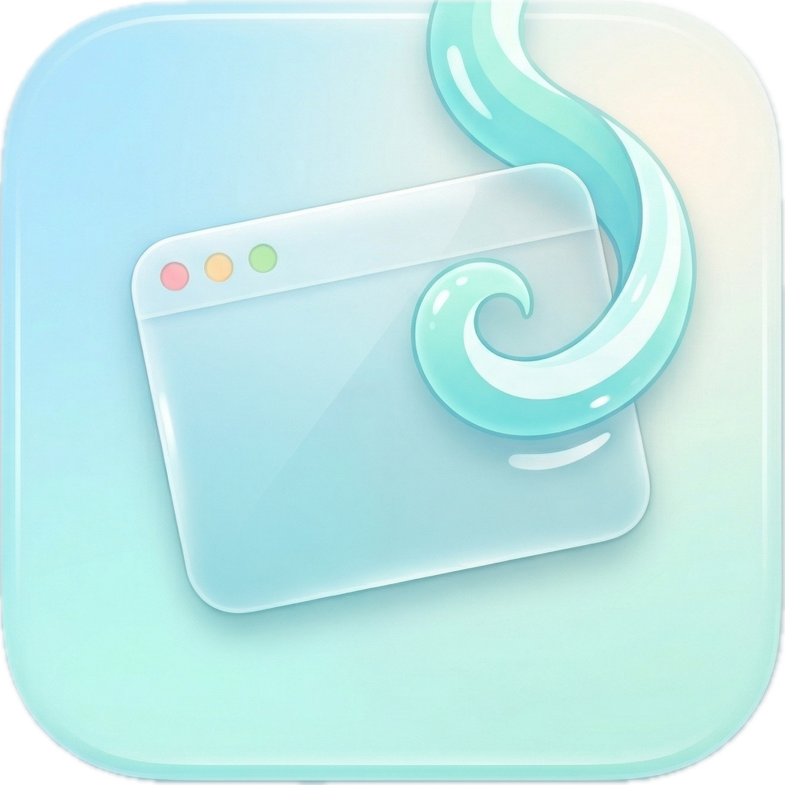
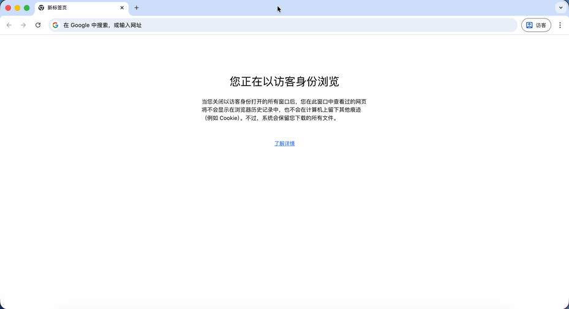

#  Swooshy

[English](./README.md) | [简体中文](./README.zh-CN.md)

A lightweight, open source, customizable trackpad enhancement tool for macOS.

Manage windows quickly with trackpad gestures and global shortcuts.

- Control the current window through Accessibility APIs
- Trigger gestures over Dock icons and window title bars
- Support multilingual UI and documentation
- Customize gesture mappings and hotkeys

## Table of Contents

- [How It Works](#how-it-works)
- [Install and Run](#install-and-run)
- [Permissions and Limitations](#permissions-and-limitations)
- [Relationship to Swish](#relationship-to-swish)
- [License](#license)

## How It Works

Swooshy manages windows with intuitive two-finger gestures. Every gesture is
anchored to one of two trigger regions: the window title bar and Dock icons.

<details open>
<summary><b>Page 1: Dock icon gesture - cycle windows of the same app</b></summary>

When the pointer is hovering over an app icon in the Dock:

* **Two-finger swipe left / right**: Quickly switch backward or forward between
  windows of that app.
* Great for Finder, browsers, editors, and any app with multiple windows.

<br>


</details>

<details>
<summary><b>Page 2: Dock icon gesture - hide and restore windows</b></summary>

Hover over an app icon in the Dock and swipe vertically on the trackpad:

* **Two-finger swipe down**: Minimize one visible window of that app.
* **Two-finger swipe up**: Restore one minimized window of that app.

<br>


</details>

<details>
<summary><b>Page 3: Dock icon gesture - pinch to quit the app</b></summary>

Hover over an app icon in the Dock and use a pinch gesture:

* **Two-finger pinch**: Quit the current app.
* This targets the application itself, not just a single window.
* If you would rather close one window, you can remap the gesture in Settings.

<br>


</details>

<details>
<summary><b>Page 4: Title bar gesture - fill screen and minimize fast</b></summary>

Move the pointer over the title bar area of the frontmost window, which acts as
the gesture trigger band:

* **Two-finger swipe up**: Expand the current window to fill the visible screen
  area.
* **Two-finger swipe down**: Minimize the current window to the Dock.
* Recognition is more reliable when you pause the pointer over the title bar
  before swiping.

<br>


</details>

<details>
<summary><b>Page 5: Title bar gesture - snap windows left and right</b></summary>

Hover over the window title bar and swipe horizontally to organize the current
layout:

* **Two-finger swipe left**: Snap the current window to the left half.
* **Two-finger swipe right**: Snap the current window to the right half.
* Great for side-by-side comparison with another window.
* **Preview**: You can see where the window will snap. For some apps with size
  constraints, Swooshy may preview the wrong frame; when that happens, Swooshy
  remembers the mismatch and improves the preview next time.

<br>


</details>

<details>
<summary><b>Page 6: Title bar gesture - corner snap mode</b></summary>

After hovering over the title bar or Dock, you can also enter a dedicated
corner snap mode:

* **Two-finger long press for 0.2s, then drag toward a corner**: Enter corner
  snap mode.
* While corner snap mode is active, sliding toward a screen edge lets you dock
  the app into one of the four corners.
* You can adjust the required hold duration later from `Settings...` ->
  `Advanced Settings`.

<br>


</details>

<details>
<summary><b>Page 7: Custom settings and global shortcuts</b></summary>

If you prefer the keyboard, Swooshy also ships with global shortcuts. Every
gesture mapping and hotkey can be re-recorded and edited from `Settings...` in
the menu bar app.

* **Snap left / right**: `Control + Option + Command + Left/Right Arrow`
* **Fill visible area**: `Control + Option + Command + Up Arrow / C`
* **Cycle windows in the same app**: `Control + Option + Command + \`` with
  `Shift` to reverse the direction
* **Close / minimize**: `Control + Option + Command + W / M`
* **Quit current app**: `Control + Option + Command + Q`

</details>

## Install and Run

Requirements:

- macOS 14 or later
- Accessibility permission granted to Swooshy
- If you install through Homebrew or Releases, the first launch may trigger an
  Apple security warning. See [Apple security warning](#apple-security-warning)
- This project is open source software and is not designed to harm your Mac

### Install with Homebrew

If you already have [Homebrew](https://brew.sh), this is the recommended path:

```bash
brew tap xiamiyu123/swooshy
brew update
brew install --cask swooshy
```


After installation, launch `Swooshy` from Launchpad or Spotlight, or run:

```bash
open /Applications/Swooshy.app
```

See [Apple security warning](#apple-security-warning) if macOS blocks the app
on first launch.

### Download from Releases

1. Open the [Releases](https://github.com/xiamiyu123/Swooshy/releases/latest)
   page
2. Download the latest `.zip` package
3. Extract it and drag `Swooshy.app` into `/Applications`
4. Double-click `Swooshy.app` to launch

After the first launch, follow the prompt to grant Accessibility permission.

<a id="apple-security-warning"></a>

### Apple Security Warning

If you install via Homebrew or Releases, macOS may initially say the app is
blocked or from an unidentified developer. You can allow it in either of these
ways.

#### Option A: Terminal (recommended)

```bash
xattr -dr com.apple.quarantine /Applications/Swooshy.app
open /Applications/Swooshy.app
```

#### Option B: System Settings

1. Try opening `Swooshy.app` once
2. Open `System Settings` -> `Privacy & Security`
3. Scroll to the bottom and find the blocked-app message for Swooshy
4. Click `Open Anyway`, then confirm again

### Run from Source

From the repository root:

```bash
swift run
```

After launch, follow the prompt to grant Accessibility permission.

### Package a Local `.app`

From the repository root:

```bash
./scripts/package-macos-app.sh
```

This produces a runnable local app bundle. Packaging notes are available in
[docs/local-packaging.md](docs/local-packaging.md).

## Permissions and Limitations

- Swooshy relies on macOS Accessibility APIs to read and move windows
- Some apps may not expose operable window information, or may not allow moving,
  resizing, or closing
- Dock and title bar gestures rely on a private multitouch input path
- The current version focuses on fast window actions rather than full tiling
  window management
- This is a lightweight first release that prioritizes common flows being
  smooth, stable, and easy to understand

## Relationship to Swish

Swooshy is inspired by the product direction of Swish, but it is an independent
open source implementation with a more explicit focus:

- Lighter weight
- Centered around a menu bar utility
- Easier to build and modify yourself
- More focused on a customizable open source experience

It is built for people who like the interaction style of Swish but want a more
open and hackable alternative.

## Project Structure

- [Sources/Swooshy/SwooshyApp.swift](Sources/Swooshy/SwooshyApp.swift): App
  entry point
- [Sources/Swooshy/AppDelegate.swift](Sources/Swooshy/AppDelegate.swift):
  Lifecycle wiring and controller setup
- [Sources/Swooshy/StatusBarController.swift](Sources/Swooshy/StatusBarController.swift):
  Menu bar UI and action entry points
- [Sources/Swooshy/SettingsWindowController.swift](Sources/Swooshy/SettingsWindowController.swift):
  Settings window
- [Sources/Swooshy/WindowManager.swift](Sources/Swooshy/WindowManager.swift):
  Window read/write powered by Accessibility APIs
- [Sources/Swooshy/DockGestureController.swift](Sources/Swooshy/DockGestureController.swift):
  Dock and title bar gesture routing
- [Sources/Swooshy/GestureFeedbackController.swift](Sources/Swooshy/GestureFeedbackController.swift):
  Gesture HUD feedback
- [ATTRIBUTION.md](ATTRIBUTION.md): References and attribution notes

## Development Notes

- `swift test`: run the test suite
- `SWOOSHY_DEBUG_LOGS=1 swift run`: force-enable debug logs at launch
- `swift run Swooshy --reset-user-config`: clear user config before launch
- `open /Applications/Swooshy.app --args --reset-user-config`: clear config and
  launch the installed `.app`
- With debug logging enabled, logs are written to
  `~/Library/Logs/Swooshy/debug.log`

## License

This project is licensed under GNU General Public License v3.0.

See [LICENSE](LICENSE) and [ATTRIBUTION.md](ATTRIBUTION.md) for details.

## Contributions and Issues

Pull requests, issues, and forks are welcome.

If Swooshy helps you, a GitHub star would mean a lot.

## AI Disclosure

This is a vibe-coded project. I used AI heavily during development, then
tested, adjusted, and cleaned things up myself.
